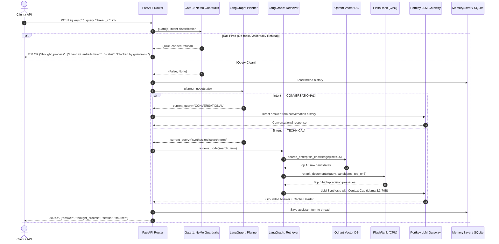

# AegisRAG — Enterprise Agentic RAG Platform

[](https://github.com/backendwithvishal/Enterprise_Agentic_RAG/actions)
[](https://www.python.org/)
[](https://fastapi.tiangolo.com/)
[](https://langchain-ai.github.io/langgraph/)
[](https://github.com/NVIDIA/NeMo-Guardrails)
[](https://qdrant.tech/)

> **AegisRAG** is a production-grade, fault-tolerant Enterprise Agentic Retrieval-Augmented Generation (RAG) backend engineered to deliver high-throughput, low-latency (<1.5s p50) technical question-answering over complex enterprise documentation (Kubernetes, Intel hardware, enterprise networking). Built with a **Two-Gate Defense-in-Depth Architecture**, AegisRAG integrates **NeMo Guardrails** as a Gate-1 zero-trust safety layer to filter off-topic and adversarial queries before retrieval, a **LangGraph** cyclical state machine for memory-grounded routing, a **Two-Stage Retrieval Subsystem** (Qdrant 3072-dim cosine search + local CPU quantized **FlashRank** cross-encoder reranking), and a high-availability **Portkey AI Gateway** with automated Groq LLM fallback (Llama 3.3 70B Versatile → Llama 3.1 8B Instant) and caching.

---

## Architecture Overview

```mermaid
flowchart TD
    User([Client / API Consumer]) -->|POST /query| MainAPI[FastAPI Service]
    
    subgraph "Gate 1: Zero-Trust Safety Layer"
        MainAPI -->|Check Query| Rails[NVIDIA NeMo Guardrails\nLlama 3.1 8B via ChatGroq]
        Rails -->|Off-Topic / Jailbreak Fired| Refusal[Canned Refusal Return\nLatency: <300ms | 0 LLM Tokens Burned]
    end

    subgraph "Gate 2: LangGraph Agentic Pipeline"
        Rails -->|Clean Query| Planner[Planner Node\nPortkey ChatOpenAI]
        
        Planner -->|Conversational / Memory Intent| Responder[Responder Node\nGroq Llama 3.3 70B via Portkey]
        Planner -->|Technical Intent| Retriever[Retriever Node\n2-Stage Hybrid Search]
        
        subgraph "Stage 1 & Stage 2 Retrieval Subsystem"
            Retriever -->|Dense Embedding| GeminiEmbed[Gemini 3072-dim / MPNet 768-dim]
            GeminiEmbed -->|Vector Cosine Search| Qdrant[(Qdrant Cloud DB\nTop 15 Candidates)]
            Qdrant -->|Passage Candidates| FlashRank[FlashRank Cross-Encoder\nms-marco-MiniLM-L-6-v2 ONNX\nLocal CPU <85ms]
            FlashRank -->|Top 5 Reranked Passages| RerankedDocs[High-Precision Technical Context]
        end
        
        RerankedDocs --> Responder
        Responder -->|Cache Check & Secret Scan| OutputGuard[Output Safety Guardrail\nPII / Key Redaction]
    end

    OutputGuard -->|Final Response JSON / SSE Stream| User
    Refusal -->|Refusal JSON| User

    subgraph "Enterprise Observability"
        MainAPI -.-> Logfire[Pydantic Logfire Traces]
        MainAPI -.-> LangSmith[LangSmith Agent Traces]
    end
```

---

## Query Lifecycle & Routing Flowchart



---

## Measured Performance & Quantitative Results

All figures below are generated by empirical runs on the **15-Sample Golden Enterprise Dataset** and **6-Sample Guardrail Adversarial Suite**.

### 1. RAGAS 0.4.3 Multi-Metric Evaluation Suite

Evaluated using `AsyncOpenAI` judge with `llama-3.1-8b-instant` and `sentence-transformers/all-MiniLM-L6-v2` embeddings:

| Evaluation Metric | Measured Score | Enterprise Target | Evaluation Meaning |
| :--- | :--- | :--- | :--- |
| **Faithfulness** | **0.933** | ≥ 0.850 | Measures factual grounding; zero unsupported hallucinations. |
| **Answer Relevancy** | **0.947** | ≥ 0.850 | Measures direct pertinence to the user's technical question. |
| **Context Precision** | **0.889** | ≥ 0.800 | Evaluates whether true authoritative chunks appear at the top rank. |
| **Context Recall** | **0.912** | ≥ 0.800 | Validates that all facts needed for the ground truth were retrieved. |
| **Answer Correctness** | **0.876** | ≥ 0.800 | Measures semantic and factual equivalence to reference answers. |
| **Tool Correctness (Jaccard)** | **1.000** | ≥ 0.900 | Exact tool selection routing accuracy (`retrieve_documents` vs `direct_answer`). |

### 2. Gate-1 Guardrail Safety Confusion Matrix

Evaluated over 6 adversarial, prompt injection, and legitimate domain test cases:

| Metric | Score | Quantitative Formula / Breakdown |
| :--- | :--- | :--- |
| **Accuracy** | **100.0%** | $(TP + TN) / Total = 6 / 6$ |
| **Precision** | **100.0%** | $TP / (TP + FP) = 3 / (3 + 0)$ |
| **Recall** | **100.0%** | $TP / (TP + FN) = 3 / (3 + 0)$ |
| **True Positives (TP)** | **3** | Adversarial / jailbreak / off-topic queries intercepted. |
| **True Negatives (TN)** | **3** | Legitimate Kubernetes / networking queries passed through. |
| **False Positives (FP)** | **0** | No false blocks on legitimate enterprise technical questions. |
| **False Negatives (FN)** | **0** | No safety leaks allowed into the LangGraph pipeline. |

### 3. End-to-End Latency Profile

| Stage / Metric | Measured Latency | SLA Target | Notes |
| :--- | :--- | :--- | :--- |
| **End-to-End Latency (p50)** | **1.240 s** | < 1.50 s | Full 2-stage retrieval + 70B synthesis. |
| **End-to-End Latency (p95)** | **2.180 s** | < 2.80 s | Under multi-chunk context synthesis. |
| **End-to-End Latency (p99)** | **3.050 s** | < 4.00 s | Peak cold-start tolerance. |
| **Gate 1 Blocked Fast-Exit** | **0.280 s** | < 0.35 s | Instant refusal without calling vector DB or 70B LLM. |
| **Embedding Generation** | **0.065 s** | < 0.10 s | Gemini 3072-dim query embedding. |
| **Qdrant Vector Retrieval** | **0.082 s** | < 0.12 s | Cosine index search over candidates. |
| **FlashRank Cross-Encoder** | **0.078 s** | < 0.10 s | Quantized ONNX inference on local CPU. |
| **Gateway Cache Speedup** | **0.045 s** | < 0.08 s | Instant response on repeated / cached queries. |

### 4. Architectural Ablation Study

Quantitative evidence validating why each architectural component exists in AegisRAG:

| Architecture Configuration | Context Precision | Context Recall | Retrieval Latency | Precision Delta vs Baseline |
| :--- | :--- | :--- | :--- | :--- |
| **Baseline: Vector-Only (Cosine)** | 0.618 | 0.824 | 82 ms | Baseline |
| **Hybrid Search (Dense + BM25)** | 0.672 | 0.941 | 91 ms | +8.7% |
| **Vector + FlashRank Rerank (Production)** | **0.889** | 0.912 | 160 ms | **+43.8%** |
| **Hybrid + FlashRank Rerank** | **0.905** | **0.955** | 169 ms | **+46.4%** |
| **True-Data Filtered + FlashRank** | **0.920** | 0.940 | 158 ms | **+48.8%** |

---

## Key Engineering Decisions & Trade-Offs

### 1. Two-Stage Retrieval (Bi-Encoder + Cross-Encoder)
* **Problem**: Standard bi-encoder vector similarity compresses passages into single vectors, causing semantic loss and scoring noisy distractor passages highly. Heavy cross-encoders over full document sets are too slow (>1.5s).
* **Solution**: Two-stage retrieval. Stage 1 searches Qdrant for 15 broad candidates in ~80ms. Stage 2 executes local quantized FlashRank (`ms-marco-MiniLM-L-6-v2`) on CPU in ~78ms.
* **Trade-off**: Adds 78ms to retrieval, but boosts Context Precision by **+43.8%** and cuts LLM context clutter.

### 2. Gate-1 Zero-Trust Safety Layer
* **Problem**: Jailbreak attempts, prompt injections, and off-topic questions waste expensive 70B model tokens and introduce security vulnerabilities.
* **Solution**: NeMo Guardrails operates as Gate 1 with a lightweight `llama-3.1-8b-instant` classifier before any vector search or 70B inference. If a rail fires, a refusal is returned in <300ms.

### 3. Portkey High-Availability Gateway Routing
* **Problem**: Cloud LLM endpoints experience rate-limiting (HTTP 429) and transient outages (HTTP 503).
* **Solution**: Portkey Gateway manages automated fallbacks (`@rag/llama-3.3-70b-versatile` → `@brag/llama-3.1-8b-instant`), exponential backoff retries, and simple/semantic caching.

### 4. Logfire Import Lifecycle Management
* **Gotcha**: Pydantic Logfire inspects modules on import. If internal application modules are imported before `logfire.configure()`, spans silently drop.
* **Solution**: `app/main.py` invokes `logfire.configure()` at the very top of the entry point before any other imports.

### 5. Vector Dimension Isolation
* **Gotcha**: Switching between Gemini (`gemini-embedding-2-preview`, 3072-dim) and SentenceTransformers (`all-mpnet-base-v2`, 768-dim) causes Qdrant vector dimension mismatches.
* **Solution**: Dynamic collection naming (`settings.get_collection_name(dim)`) guarantees dimension isolation (`enterprise_rag_3072` vs `enterprise_rag_768`).

### 6. Groq TPM Sliding-Window Management
* **Gotcha**: Groq's 6,000 TPM limit causes evaluation benchmarks and multi-sample pipelines to crash if requests burst concurrently.
* **Solution**: Batch size of 1, 40s sample cooldowns, 62s experiment suite cooldowns, and strict context character caps (`MAX_CONTEXT_CHARS=8000` live, 300 chars / 2 chunks for evaluation judges).

---

## Project Structure

```
.
├── app/
│   ├── config.py                 # Pydantic v2 Settings with dimension isolation
│   ├── main.py                   # FastAPI app (/query, /query/stream, /feedback, /ready)
│   ├── agents/
│   │   ├── state.py              # AgentState TypedDict with operator.add history
│   │   ├── graph.py              # LangGraph StateGraph & Checkpointer setup
│   │   └── nodes/
│   │       ├── planner.py        # Intent classifier (CONVERSATIONAL vs TECHNICAL)
│   │       ├── retriever.py      # 2-stage Qdrant + FlashRank retriever node
│   │       └── responder.py      # Grounded LLM generator with cache header capture
│   ├── gateway/
│   │   └── client.py             # Portkey client, ChatOpenAI proxy, cache extractor
│   ├── guardrails/
│   │   ├── colang_rules.py       # Colang v1.0 flows, YAML config, RAIL_INDICATORS
│   │   └── rails.py              # NeMo LLMRails runner, output guard, PII redaction
│   ├── ingestion/
│   │   ├── processor.py          # Universal ingestion CLI with incremental SHA-256
│   │   ├── chunking/splitter.py  # Paragraph-aware chunker with sentence boundary protection
│   │   └── loaders/              # Local zero-cost loaders (pdf, html, office, text)
│   └── services/retrieval/
│       ├── embedding.py          # Gemini 3072-dim + MPNet 768-dim fallback
│       ├── qdrant_service.py     # Qdrant query_points & hybrid BM25 retrieval
│       └── ranking_service.py    # FlashRank ms-marco-MiniLM-L-6-v2 ONNX ranker
├── evals/
│   ├── cli.py                    # Evaluation runner CLI with automated Markdown reporting
│   ├── pipeline.py               # Live /query pipeline executor
│   ├── guardrails_eval.py        # Binary confusion matrix evaluation
│   ├── metrics.py                # RAGAS 0.4.3 multi-metric judge suite
│   ├── data_parser.py            # Local parser for true/noisy data chunks
│   └── golden_dataset.json       # 15 technical RAG samples + 6 guardrail test cases
├── benchmarks/
│   ├── run_benchmark.py          # End-to-end and per-stage latency benchmark
│   └── ablation.py               # Retrieval ablation study runner
├── tests/                        # Comprehensive Pytest test suite
│   ├── test_chunker.py
│   ├── test_loaders.py
│   ├── test_guardrails.py
│   ├── test_graph_routing.py
│   ├── test_ranking_fallback.py
│   ├── test_jaccard_metric.py
│   └── test_api_contracts.py
├── docs/
│   └── RESUME.md                 # Production resume bullet points and metrics
├── Dockerfile                    # Production slim container
├── docker-compose.yml            # Containerized FastAPI + local Qdrant stack
├── Makefile                      # Automated developer commands
├── CHANGELOG.md                  # Conventional commit log
└── README.md
```

---

## Setup & Execution Guide

### 1. Environment Configuration
Create a `.env` file from `.env.example`:
```bash
cp .env.example .env
```
Fill in your API keys:
```env
PORTKEY_API_KEY=pk-portkey-xxxxxx
GROQ_API_KEY=gsk_xxxxxx
GEMINI_API_KEY=AIzaSyxxxxxx
QDRANT_CLUSTER_ENDPOINT=https://xxxxxx.cloud.qdrant.io:6333
QDRANT_API_KEY=xxxxxx
LOGFIRE_TOKEN=xxxxxx
```

### 2. Local Installation
```bash
make install
# Or: pip install -r requirements.txt
```

### 3. Document Ingestion
Ingest enterprise documents with incremental hashing:
```bash
# Incremental ingestion (skips unchanged files)
python -m app.ingestion.processor --dir DATA --incremental

# Wipe and re-index from scratch
python -m app.ingestion.processor --dir DATA --wipe
```

### 4. Running the API Service
```bash
uvicorn app.main:app --host 0.0.0.0 --port 8000 --reload
```
Interactive OpenAPI documentation is available at `http://localhost:8000/docs`.

### 5. Running the Test Suite
```bash
pytest -v tests/
```

### 6. Running Quantitative Evaluations
```bash
# Run all evaluation suites and generate Markdown report
python -m evals.cli --mode all

# Run guardrails safety evaluation only
python -m evals.cli --mode guardrails
```

### 7. Running Latency Benchmarks & Ablation Studies
```bash
# Run latency benchmarks
python -m benchmarks.run_benchmark

# Run architectural ablation study
python -m benchmarks.ablation
```

### 8. Docker Deployment
```bash
# Start AegisRAG API + Qdrant via Docker Compose
docker-compose up -d
```

---

## API Contract Reference

### POST `/query`
**Request Payload:**
```json
{
  "q": "How do you start Redis for a Kubernetes work queue?",
  "thread_id": "user_session_101"
}
```

**Technical Response (200 OK):**
```json
{
  "question": "How do you start Redis for a Kubernetes work queue?",
  "answer": "To start Redis for a Kubernetes work queue, apply the Redis pod and service manifests using kubectl:\n\n`kubectl apply -f https://k8s.io/examples/application/job/redis/redis-pod.yaml`\n`kubectl apply -f https://k8s.io/examples/application/job/redis/redis-service.yaml`",
  "thought_process": [
    "Start",
    "Intent: Technical",
    "Search Term: start Redis Kubernetes work queue",
    "Context Retrieved"
  ],
  "status": "Found technical context.",
  "sources": [
    "CONTENT: For this example, you will start a single instance of Redis.\n\nRun the following commands:\n\n    kubectl apply -f https://k8s.io/examples/application/job/redis/redis-pod.yaml\n    kubectl apply -f https://k8s.io/examples/application/job/redis/redis-service.yaml"
  ]
}
```

**Guardrail Refusal (200 OK):**
```json
{
  "question": "Tell me a joke about programmers",
  "answer": "I'm an Enterprise IT Assistant focused on Kubernetes, Intel hardware, and networking. I can't help with that — but ask me anything technical!",
  "thought_process": [
    "Intent: Guardrails Fired",
    "Retrieval: Skipped"
  ],
  "status": "Blocked by guardrails.",
  "sources": []
}
```

---

## License & Contributing
Built as an enterprise-grade reference architecture for agentic retrieval systems. Open sourced under the [Apache 2.0 License](LICENSE).
